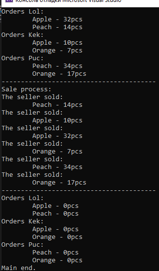

# Задание 2
 * Создайте приложение по шаблону Console Application. 
 
 * Создайте следующиеклассы:
```c#
  internal class Product
  {
    public string Name { get; set; }
    public int Quantity { get; set; }
  }
  
  internal class Customer
  {
    publicstringName { get; set; }
    publicstringPhone { get; set; }
    publicstringAddress { get; set; }
  }
  
  internal class Order
  {
    public Customer Customer { get; set; }
    public List<Product> Products { get; set; }
  }
```
 * Создайте класс Shop.
  
 * Внутри него создайте:
   *   Коллекцию ConcurrentDictionary, 
    которая по имени покупателя будет хранить его заказы.
 
   *   Метод с названием MakeAnOrder, 
    в теле которого должен создаваться новый экземпляр класса Product,
    и добавлятьсяв коллекцию. Если там такой продукт уже есть, 
    необходимо изменить его количество.

   *   Метод с названием ProcessOrders, 
    в теле которого вы должны изымать из коллекции продукты,
    и выводить на экран консоли название продукта,
    и сколько единиц было куплено.

 * В классе Program используя задачи создайте несколько покупателей,
  которые будут делать несколько заказов,
  а также создайте одного сотрудника, который будет обрабатывать заказы.

Итог:
