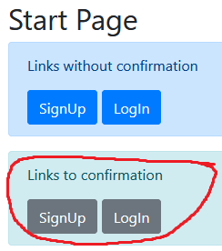

## Confirm account to eMail

For confim account, create a new services, that will be send an email with an offer to confirm account. This - **EmailServices**.

For example:
```C#
public class EmailService
{
    public const string fromLogin = "yourEmail";
    private const string pass = "yourEmailPassword";
    public async Task SendEmailAsync(string emailTo, string subject, string message, string emailFrom = fromLogin, string fromPassword = pass, string smtpHost = "smtp.mail.ru", int smtpPort = 465)
    {
        var mess = new MimeMessage();

        mess.From.Add(new MailboxAddress("FromKek PucName", fromLogin));
        mess.To.Add(new MailboxAddress("", emailTo));
        mess.Subject = subject;
        mess.Body = new TextPart(MimeKit.Text.TextFormat.Html)
        {
            Text = message
        };

        using(var client = new SmtpClient())
        {
            await client.ConnectAsync(smtpHost, smtpPort, true);
            await client.AuthenticateAsync(fromLogin, fromPassword);
            await client.SendAsync(mess);

            await client.DisconnectAsync(true);
        }
    }
}
```

We will also create view forms and data models(*see the previous examples or code examples*).

[here](https://github.com/eBenya/TasksMCB-/blob/master/Identity/TestASP/Views/Account/RegisterWithConfirm.cshtml) and 
[here](https://github.com/eBenya/TasksMCB-/blob/master/Identity/TestASP/Views/Account/LoginWithConfirm.cshtml)

Config Sturtup file:

```C#
public void ConfigureServices(IServiceCollection services)
{
    string conStr = "Connection string to db";
    services.AddDbContext<ApplicationContext>(options => options.UseSqlServer(conStr));
 
    services.AddIdentity<User, IdentityRole>()
        .AddEntityFrameworkStores<ApplicationContext>()
        .AddDefaultTokenProviders();
    services.AddControllersWithViews();
}
```

And create controllers, where we will be send message to email with a confirmation link.
[See here](https://github.com/eBenya/TasksMCB-/blob/bc7f99c4dc18cc9095c3f4d03a1ee5040cf240ce/Identity/TestASP/Controllers/AccountController.cs#L95)

Part of the example:
```C#
public async Task<IActionResult> RegisterWithConfirm(RegisterViewModel model)
{
    if (ModelState.IsValid)
    {
        User user = new User { Email = model.Email, UserName = model.Email, Year = model.Year };
        // add user
        var result = await _userManager.CreateAsync(user, model.Password);
        if (result.Succeeded)
        {
            //get email token, for generate url to send to email
            var token = await _userManager.GenerateEmailConfirmationTokenAsync(user);
            var callbackUrl = Url.Action("ConfirmEmail", "Account",
                new { userId = user.Id, token = token },
                protocol: HttpContext.Request.Scheme);
            var emailService = new EmailService();

            //Send message
            await emailService.SendEmailAsync(model.Email, "Confirm your account.",
                $"For confirm registration, move to link: <a href=\"{callbackUrl}\">link</a>");
            return Content("For registration end, check your email and go to the link");
        }
        else
        {
            foreach (var error in result.Errors)
            {
                ModelState.AddModelError(string.Empty, error.Description);
            }
        }
    }
    return View(model);
}
```

To check this part, use the lower button block.

