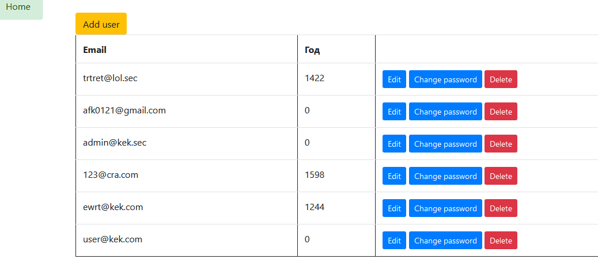

## About app
App for tests **identity**

For work app, edit next [file](https://github.com/eBenya/TasksMCB-/blob/a82490ab121f4d5ea14d3a26c4044cb7a7467bdc/Identity/TestASPapp/Services/EmailService.cs#L13)
Write your email server username and password.

### Start Page:

### LogIn Page:

### Register Page:

### Authorize Page:

### UsersList Page:

### ChangePassword Page:

### EditUser Page:

### RoleList Page:

### GroupUsers Page:

### AccessPermissions Page:

